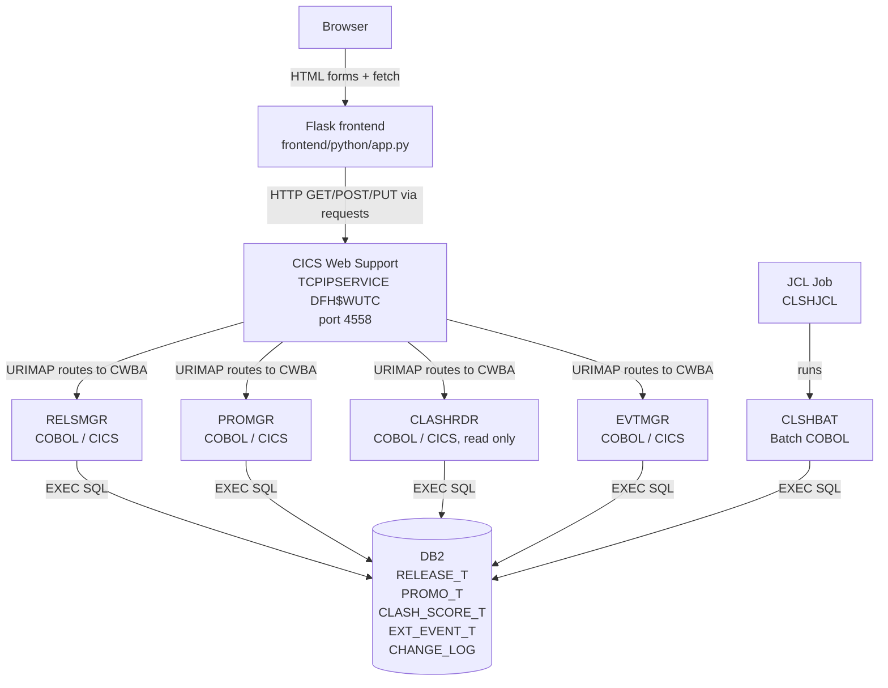

# RELEASE-PROMO-ORCHESTRATOR

> ⚠️ **Disclaimer:** This repository is a **personal learning project** - designed, written, and tested entirely by me while studying IBM mainframe development (IBM Z Xplore). It may be **incomplete**, may not cover all edge cases or error conditions, and is not intended for production use. No authentication is implemented; the site is fully open on its host/port by design, this is a local learning demo, not a production deployment. Think of this repository as a **reference point** for anyone learning how CICS, DB2, batch COBOL, and a Flask frontend fit together into one working system.

## About This Repository

Release & Promo Orchestrator is a full-stack mainframe project that tracks content releases (titles, platforms, release windows) and their promo checklists, then calculates a **clash risk score** for every pair of confirmed releases based on schedule overlap, target market, genre, and nearby external events (e.g. holidays, sports finals). The whole stack runs through the CICS region's own built-in HTTP support, no external web server or middleware involved.

**Technologies used across the repo:** `COBOL` · `CICS Web Support` · `DB2 for z/OS` · `JCL` · `Flask` · `JavaScript` · `IBM z/OS`

## What It Does

RELEASE-PROMO-ORCHESTRATOR keeps four kinds of records in sync:

- **Releases** - a title with a genre, platform, market, release date, and promo window, plus a status (`CONFIRMED`, `DRAFT`, `CANCELLED`).
- **Promo checklist items** - individual marketing tasks tied to a release (press kit, social campaign, trailer, broadcast slot), each with an owner, due date, and status (`PENDING`, `IN-PROG`, `DONE`).
- **External events** - dates not tied to any release (holidays, competing broadcasts) that can still create scheduling risk.
- **Clash risk scores** - a computed 0-100 score for every pair of `CONFIRMED` releases, explaining why two releases might compete for attention.

## Business Logic

- **Release lifecycle.** A release starts as `DRAFT`, moves to `CONFIRMED` once its date, window, and market are final, and can be marked `CANCELLED` at any point. Only `CONFIRMED` releases are eligible for clash scoring - draft and cancelled releases are excluded so risk scores always reflect real scheduling conflicts.
- **Promo checklist ownership.** Each promo item belongs to exactly one release (`PROMO_T.RELEASE_ID` foreign key) and tracks its own status independently of the release status. A release can be `CONFIRMED` while its promo items are still `PENDING`, which is why the dashboard surfaces "pending promo items" as its own top-line metric rather than inferring it from release status.
- **External events as risk context.** Events in `EXT_EVENT_T` are deliberately not linked to a specific release. They represent market-wide conditions (a holiday weekend, a competitor's broadcast) that raise clash risk for any release whose window overlaps them, which is why they carry their own market and severity fields instead of a release ID.
- **Clash risk scoring ([`CLSHBAT`](backend/COBOL/CLSHBAT.cbl)).** For every unique pair of `CONFIRMED` releases, [`CLSHBAT`](backend/COBOL/CLSHBAT.cbl) computes a 0-100 score from four independent factors and writes one row per pair into `CLASH_SCORE_T`:

  | Component | Max points | Trigger |
  |---|---|---|
  | Window overlap | 40 | Days the two release windows overlap |
  | Same market | 25 | Both releases target the same market (or either is `GLOBAL`) |
  | Same genre | 20 | Both releases have the same genre |
  | Event proximity | 15 | A release window is within 30 days of a relevant external event |

  The score and the human-readable factor breakdown (e.g. `OVERLAP=46d,MARKET=NO,GENRE=NO,EVTPROX=6d-MED`) are stored together, so the UI can explain *why* a pair is risky, not just *how* risky it is. See [`docs/scoring-formula.md`](docs/scoring-formula.md) for the full algorithm and a worked example.
- **Scoring is a deliberate batch step, not a trigger.** `CLASH_SCORE_T` is only ever populated by running [`CLSHBAT`](backend/COBOL/CLSHBAT.cbl) by hand - there is no button on the site and no automatic recalculation when a release is edited. This keeps the demo's DB2 batch/online split visible: online CICS programs handle CRUD, while the batch COBOL program owns analytics.
- **No release renaming as an edit.** `PROMO_T.RELEASE_ID` is treated as immutable once set; changing it would represent moving a promo item to a different release rather than editing the item, so the update path simply doesn't expose it as an editable field.

## Architecture



Requests flow one way down and the response flows back up: the browser talks only to Flask, Flask talks only to CICS over HTTP, CICS routes to the COBOL program that owns the operation, and every read or write goes through DB2.

| Program | Type | Table | Functions |
|---|---|---|---|
| [RELSMGR](backend/COBOL/RELSMGR.cbl) | CICS | RELEASE_T | ADD / GET / LIST / UPD / DEL |
| [PROMGR](backend/COBOL/PROMGR.cbl) | CICS | PROMO_T | ADD / GET / LIST / UPD / DEL |
| [EVTMGR](backend/COBOL/EVTMGR.cbl) | CICS | EXT_EVENT_T | ADD / GET / LIST / UPD / DEL |
| [CLASHRDR](backend/COBOL/CLASHRDR.cbl) | CICS | CLASH_SCORE_T | GET only, read-only |
| [CLSHBAT](backend/COBOL/CLSHBAT.cbl) | Batch | CLASH_SCORE_T | Recalculates risk scores for all CONFIRMED releases |

All four CICS programs share the same `TCPIPSERVICE(DFH$WUTC)` on port 4558 and the same `DB2ENTRY(CSMID)` with `TRANSID(CWBA)`. Full CRUD, including DELETE, is implemented for all three editable entities.

## Screenshots

| # | Screenshot | What it shows |
|---|---|---|
| 1 | [`1-dashboard-overview.png`](screenshots/1-dashboard-overview.png) | The Release Radar landing page: total releases, draft count, pending promo items, average clash risk, and the highest-risk release pair, followed by a Gantt-style timeline of each release's promo window colored by its risk badge. |
| 2 | [`2-release-overview.png`](screenshots/2-release-overview.png) | The releases table - every release with its genre, platform, release date, window end, market, and status, with inline Edit/Delete actions and an Export CSV button. Clicking a row filters the promo and clash data shown elsewhere on the page. |
| 3 | [`3-promo-checklist-overview.png`](screenshots/3-promo-checklist-overview.png) | The promo checklist table - every promo task linked to its release ID, item name, status, due date, and owner, with Edit/Delete actions and an Add promo item button. |
| 4 | [`4-external-events-overview.png`](screenshots/4-external-events-overview.png) | The external events table - events not tied to a specific release (e.g. holiday peaks, competing weekends), showing name, date range, market, and severity, used as extra context for clash scoring. |
| 5 | [`5-clash-risk-overview.png`](screenshots/5-clash-risk-overview.png) | The clash risk table - every scored release pair, its risk score, the breakdown of scoring factors (overlap days, market match, genre match, event proximity), and the timestamp it was scored. |
| 6 | [`6-add-form.png`](screenshots/6-add-form.png) | The inline "Add release" form beneath the releases table: title, genre, platform, release date, window end, and market fields, with Save release / Cancel buttons. |
| 7 | [`7-edit-form.png`](screenshots/7-edit-form.png) | The inline "Edit release" form, pre-populated with an existing release's values so any field except the release ID can be updated in place. |
| 8 | [`8-delete-form.png`](screenshots/8-delete-form.png) | The delete confirmation state for a release row, guarding against accidental removal of a release and its dependent promo/clash data. |
| 9 | [`9-order-and-search-overview.png`](screenshots/9-order-and-search-overview.png) | The releases table filtered by the search box (e.g. searching "STREAMING") and by risk-level tabs (All / High / Medium / Low), demonstrating the combined search-and-filter behavior. |
| 10 | [`10-change-status-overview.png`](screenshots/10-change-status-overview.png) | The status dropdown on a release row being changed (e.g. `CONFIRMED` → `CANCELLED`), showing how a status change immediately affects dashboard counts and clash scoring eligibility. |

## Repository Structure

```
RELEASE-PROMO-ORCHESTRATOR/
├── backend/
│   ├── COBOL/        - RELSMGR, PROMGR, EVTMGR, CLASHRDR, CLSHBAT source
│   ├── COPYBOOK/      - Shared copybooks (e.g. SQLCA)
│   ├── DDL/           - CREATTAB.sql, SEEDDATA.sql, VERIFSCR.sql
│   └── JCL/           - COMPILE.jcl, CLSHJCL.jcl
├── docs/
│   ├── cics-ws-guide.md      - CICS Web Support routing, URIMAPs, curl tests, troubleshooting
│   ├── db2-schema.md         - Table layouts, FK order, sequences, DDL run order
│   ├── scoring-formula.md    - Clash risk scoring algorithm, worked example
│   └── manual-tests.md       - HTTP + DB2 verification tests run against the live system
├── frontend/
│   ├── python/        - Flask app (app.py)
│   └── templates/     - HTML/JS dashboard pages
├── screenshots/       - Dashboard and form screenshots
├── startup_checklist.md  - Full startup, diagnostics, and PKLIST reference
└── LICENSE
```

## Getting Started

1. **Read** [`startup_checklist.md`](startup_checklist.md) first, it covers the full startup sequence, diagnostics table, and the PKLIST rule that trips up this project the most.
2. **Set up DB2** using the scripts in [`backend/DDL/`](backend/DDL/) in order: `CREATTAB.sql` → `SEEDDATA.sql` → submit `CLSHJCL.jcl` → `VERIFSCR.sql`.
3. **Install CICS resources** via `CEDA INSTALL GROUP(ORCHGRP)` (programs, URIMAPs, all defined interactively, no JCL).
4. **Start Flask** ([`frontend/python/app.py`](frontend/python/app.py)) and open the printed URL in a browser.
5. **Verify** using the curl tests in [`docs/manual-tests.md`](docs/manual-tests.md).

## Documentation

| File | Description |
|---|---|
| [`docs/cics-ws-guide.md`](docs/cics-ws-guide.md) | CICS Web Support routing, resource definitions, URL reference, troubleshooting table |
| [`docs/db2-schema.md`](docs/db2-schema.md) | Full table/column reference, FK dependency diagram, sequences |
| [`docs/scoring-formula.md`](docs/scoring-formula.md) | Clash risk scoring algorithm, SCORE_FACTORS format, worked example |
| [`docs/manual-tests.md`](docs/manual-tests.md) | curl + SQL verification tests run against the live system |
| [`startup_checklist.md`](startup_checklist.md) | Startup sequence, diagnostics, PKLIST rule, known limitations |

## Known, Deliberately Accepted Limitations

- No authentication, fine for a local demo, not meant for production use.
- `PROMO_T.RELEASE_ID` cannot be changed via UPD (would be a "move to a different release" operation, not an edit).
- `CLASH_SCORE_T` is only ever populated by [`CLSHBAT`](backend/COBOL/CLSHBAT.cbl), run by hand, no button on the site triggers it.

## Author

Self-taught mainframe developer. Built end-to-end (COBOL, CICS, DB2, JCL, Flask) as a hands-on IBM Z Xplore learning project.
